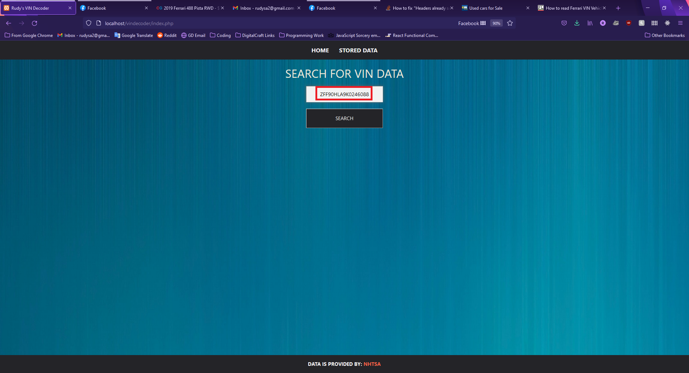
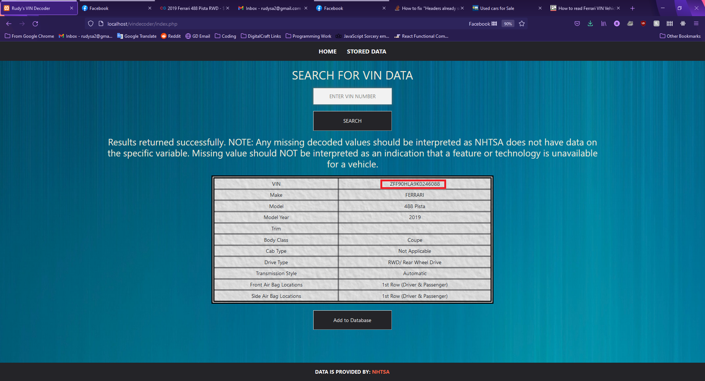
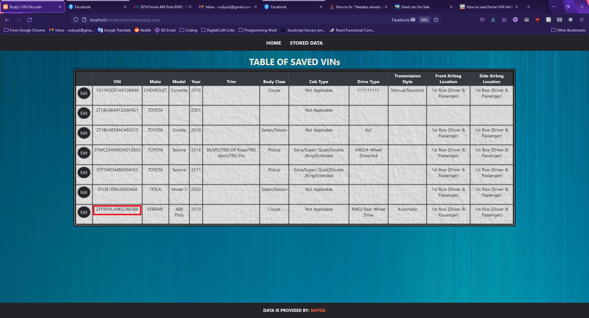
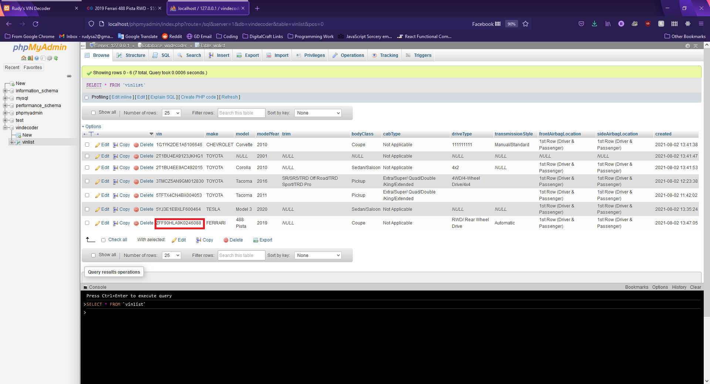
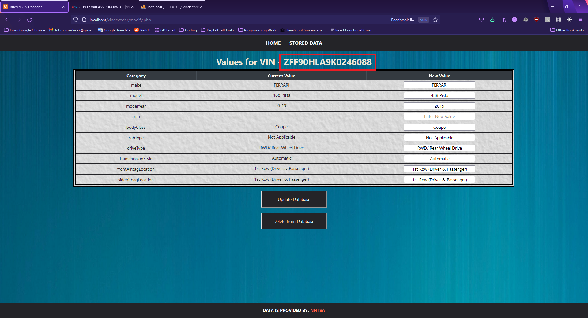
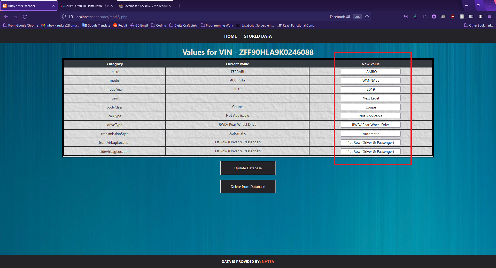
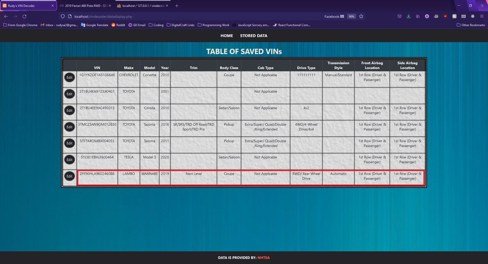
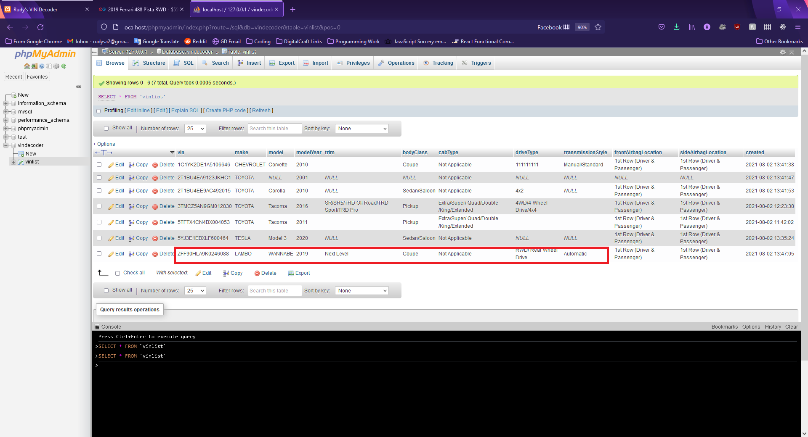
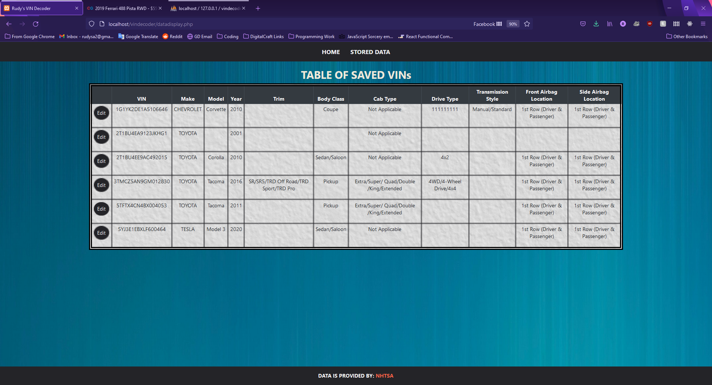
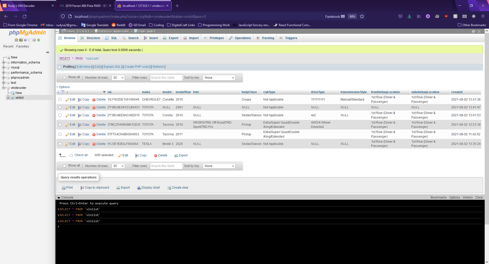

# Rudy's vinDecoder

Interface for viewing, modifying, and storing data gathered from NHTSA API Vin Decoder - https://vpic.nhtsa.dot.gov/api/

You can find test VINs here - https://www.carmax.com

## How to Use

Clone Repo to local device. Use XAMPP to run Apache and MYSQL on your local machine. Run the SQL Table Statement below to build your table in mysql.

```SQL
CREATE TABLE IF NOT EXISTS `vinList`(
     `vin` VARCHAR(255) NOT NULL,
     `make` VARCHAR(255),
     `model` VARCHAR(255),
     `modelYear` INT(11),
     `trim` VARCHAR(255),
     `bodyClass` VARCHAR(255),
     `cabType` VARCHAR(255),
     `driveType` VARCHAR(255),
     `transmissionStyle` VARCHAR(255),
     `frontAirbagLocation` VARCHAR(255),
     `sideAirbagLocation` VARCHAR(255),
     `created` DATETIME NOT NULL DEFAULT CURRENT_TIMESTAMP,
     PRIMARY KEY(`vin`)
     ) ENGINE = INNODB DEFAULT CHARSET = utf8;
```

## Example of Site in Use

Enter your VIN in the input field and click the "Search" button.



You will then have a table displayed with categories and values relating the input VIN. This data can be added to your database with the "Add to Database" button.



Clicking the "Data" link in the header will display a table with all the contents of your database. 



And we can compare to our PHP local DB:



Clicking the edit button will display another table with inputs that allows you to modify the data for that entry. 



Data values will be updated with values in "New Value" fields when clicking the "Update Database" button.



Clicking the "Update Database" button will return you to the "Data" page and the new values will be visible.



Here we can compare changes on our PHP local DB.



Returning to edit the same VIN. The "Delete From Database" button will remove the VIN and connected values completed from the database.



Here we can compare with local PHP DB and see that the VIN and associated values have been removed.

